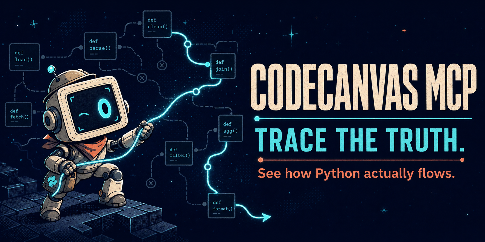

<p align="center">
  
</p>

# CodeCanvas MCP

[](https://pypi.org/project/codecanvas-mcp/)
[](https://pypi.org/project/codecanvas-mcp/)
[](LICENSE)

Understand an unfamiliar Python system before spending thousands of tokens
reading it file by file.

CodeCanvas is a local static-analysis
[Model Context Protocol](https://modelcontextprotocol.io/) server for Python. It
turns project-wide call paths and control flow into compact, citation-ready
answers about branches, callers, callees, side effects, and change impact.

In a blinded three-task holdout on Google ADK's 433K-line Python codebase, the
`logic_flow` profile used **52.58% fewer server-reported input + output tokens**
than the same-run built-in-tools control while scoring **99.5/100** versus
100/100. See the [audited methodology, detailed results, and
limitations](benchmarks/README.md).

Use it to answer questions such as:

- Who calls this function, directly or transitively?
- What can this function reach, and where do side effects happen?
- Under which guards can this return or exception occur?
- Does this source really reach that target in the requested mode?
- Which API routes, scripts, or public exports are affected by a diff?

CodeCanvas is Python-only and requires Python 3.10 or newer.

## See the difference

Ask one question:

```text
Use logic_flow on UserService.update_user. Show its branches, outcomes,
downstream effects, and evidence quality.
```

Excerpt from the actual response on the
[included FastAPI sample](sample-fastapi/app/services/user_service.py):

```json
{
  "function": "app.services.user_service.UserService.update_user",
  "source": "app/services/user_service.py:13",
  "flow": [
    "15  user = await self.user_repo.find_by_id(...)",
    "16  if user is None:",
    "17      → return None",
    "18  → return await self.user_repo.update(user_id, user)"
  ],
  "outcomes": [
    {"at": 17, "detail": "None", "guards": ["user is None"]},
    {"at": 18, "detail": "await self.user_repo.update(user_id, user)", "guards": []}
  ],
  "downstream": [
    {
      "function": "app.repositories.user_repo.UserRepository.find_by_id",
      "location": "app/repositories/user_repo.py:13",
      "effects": ["db"]
    },
    {
      "function": "app.repositories.user_repo.UserRepository.update",
      "location": "app/repositories/user_repo.py:18",
      "effects": ["db"]
    }
  ],
  "evidence_grade": "inferred",
  "safe_to_summarize": false,
  "response_guidance": "Do not turn inferred call edges into unconditional claims."
}
```

That single response exposes the early return, success path, downstream database
work, exact source locations, and how cautiously the agent may summarize the
result.

## Quick start

Install [uv](https://docs.astral.sh/uv/) if `uvx` is not already available,
then register the server with Claude Code:

```bash
claude mcp add codecanvas -- uvx codecanvas-mcp
```

That command exposes the complete tool catalog. Keep the full catalog enabled
when your MCP client supports on-demand tool discovery or tool search: the
client can load the relevant schemas only when they are needed, so the other
CodeCanvas tools remain available without paying their schema cost on every
model request.

```toml
[mcp_servers.codecanvas]
command = "uvx"
args = ["codecanvas-mcp"]
```

If your client eagerly injects every enabled tool schema into every model
request, use this compatibility profile instead:

```toml
[mcp_servers.codecanvas]
command = "uvx"
args = ["codecanvas-mcp"]
enabled_tools = ["logic_flow", "who_calls", "call_tree"]
```

The three-tool allow-list is a fallback for eager-schema clients, not a
recommendation to discard the rest of CodeCanvas. For another MCP client, use
the equivalent stdio configuration:

```json
{
  "mcpServers": {
    "codecanvas": {
      "command": "uvx",
      "args": ["codecanvas-mcp"]
    }
  }
}
```

Pass an absolute `project_path` on the first tool call. CodeCanvas remembers the
last explicitly selected project for the rest of the server session.

With the complete catalog enabled, `project_status` reports candidate analysis
roots for nested Python projects. Compact-profile users should pass the intended
nested root explicitly.

## Teach your agent when to use it

Adding tools does not guarantee that an agent will choose them at the right
time. Put a short instruction like this in `AGENTS.md`, `CLAUDE.md`, or the
equivalent file used by your coding agent:

```markdown
## Code analysis

Use CodeCanvas before text search when you need to know:

- how a Python function branches, returns, and produces side effects;
- who calls it directly or transitively;
- what it reaches downstream through project-internal calls.

Pass `project_path` once, then reuse the active project. Treat
`safe_to_summarize: false`, inferred edges, ambiguity, and truncation as
qualifications rather than unconditional facts.

Start with `logic_flow`. Use `who_calls` for upstream impact and `call_tree`
for a deeper downstream trace.
```

Then ask your agent naturally:

```text
Use logic_flow first to understand checkout without repeated source searches.
What calls UserService.update_user, up to three hops?
What does checkout reach downstream, including HTTP or database effects?
```

With the complete catalog enabled, CodeCanvas can also answer:

```text
List the entrypoints in this project.
Under exactly what conditions can authenticate raise?
Verify that dry-run publish reaches _call_api.
Analyze the impact of the current diff.
```

## Why not just grep or an LSP?

CodeCanvas complements both. It is for behavioral questions that otherwise
require repeated searches and manual reconstruction.

| Need | grep | LSP | CodeCanvas |
|---|---|---|---|
| Exact text | Best fit | Not its job | Keep using grep |
| Definitions and direct references | Manual | Best fit | Resolves symbols inside structural results |
| Transitive callers and callees | Repeated manual hops | References are not a call path | Bounded upstream and downstream graphs |
| Branch guards and outcomes | Read and reconstruct source | Usually not modeled | Structured flow and guarded returns/raises |
| Side effects and change impact | Infer manually | Usually not modeled | Effects attributed through call paths and entrypoints |
| Uncertainty | No confidence model | Resolution-dependent | Evidence grade, ambiguity, truncation, and guidance |

## What makes the answers trustworthy

Static analysis is not runtime truth, so CodeCanvas makes uncertainty visible
instead of hiding it.

Every successful MCP response identifies the selected `analysis_root` and
includes metadata that helps an agent decide how strongly it may state the
result:

- `evidence_grade` describes the strength of the resolved evidence.
- `inferred_edge_count` and `ambiguous_calls` expose uncertain call edges.
- `truncated` says whether the bounded response omitted results.
- `safe_to_summarize` says whether the result supports an unconditional claim.
- `response_guidance` explains how to qualify a result when it does not.

`verify_claim` goes further by combining candidate call paths with branch and
return/raise guards. It returns `true`, `false`, or `uncertain`; unsupported
qualifiers and inferred-only paths cannot silently become a definite `true`.

## Tools

### Discover and understand

| Tool | Use it for |
|---|---|
| `project_status` | Inspect the active root, Python file count, cache, worker interpreter, and nested project candidates |
| `list_entrypoints` | Find FastAPI routes, scripts, function entrypoints, and distributed library exports |
| `find_symbols` | Locate functions, methods, and classes with exact-first name, semantic, or hybrid search |
| `logic_flow` | Get one compact, citation-ready view of a function's branches, outcomes, downstream calls, and effects |
| `what_does` | Triage a function from its signature, docstring, calls, effects, exceptions, and direct risk |
| `function_flow` | Inspect a structured branch tree with subjects, conditions, scopes, and nesting |
| `reaching_conditions` | Get the enclosing guards for each return or raise, plus complexity and unreachable code |

### Follow behavior and assess change

| Tool | Use it for |
|---|---|
| `who_calls` | Walk direct or transitive callers upstream |
| `call_tree` | Walk project-internal callees downstream and attribute direct/transitive effects |
| `verify_claim` | Conservatively check a qualified `source reaches target` claim against paths and guards |
| `analyze_impact` | Map an inline diff or git ref to changed functions and affected entrypoints/public surfaces |

### Reproduce state-shaped bugs

| Tool | Use it for |
|---|---|
| `validate_state_schema` | Compare a function's state reads, writes, and mapping returns with a caller-provided schema |
| `simulate_state_transition` | Execute focused generated or explicit state cases with invariants and dependency overrides |

Large result sets are capped. Use each tool's `filter`, `kind`, `path`, `depth`,
or pagination arguments to narrow the answer before treating it as complete.

## How it works

1. **Select a project.** CodeCanvas resolves and remembers an explicit Python
   project root. Ambiguous nested roots must be selected rather than guessed.
2. **Build structural indexes.** Python AST analysis builds a project-wide call
   graph and per-function control-flow data. Extractors add FastAPI routes and
   `Depends()` chains, scripts, generic function entrypoints, and package
   exports.
3. **Reuse compatible analysis.** The call graph and entrypoints are cached in
   `<project>/.codecanvas/`; an in-process builder is reused during the MCP
   session.
4. **Project compact answers.** Each MCP tool queries the shared analysis and
   returns bounded results with origin, evidence, ambiguity, and truncation
   metadata.

The default analysis limit is 5,000 Python files. Tune large-project behavior
with:

| Variable | Default | Description |
|---|---:|---|
| `CODECANVAS_MAX_FILES` | `5000` | Maximum Python files to analyze |
| `CODECANVAS_BATCH_SIZE` | `50` | Files processed before yielding |
| `CODECANVAS_THROTTLE_MS` | `10` | Delay between batches in milliseconds |

## Safety and limitations

- CodeCanvas analyzes Python source; it does not model every possible dynamic
  import, monkey patch, reflection path, or runtime value.
- Inferred and ambiguous edges are reported as qualifications, not promoted to
  definite evidence.
- Static-analysis tools read project files and write the local `.codecanvas/`
  cache. No remote CodeCanvas service is required.
- `simulate_state_transition` is different: it imports and executes trusted
  project code in a separate process. It is isolation for focused repros, not a
  security sandbox. Project code may still access the filesystem, network, or
  subprocesses and may have import-time side effects.
- The simulator prefers `<project>/.venv` or `venv`, then the same directories
  in the parent project. Use `python_executable` to choose explicitly and check
  the returned `worker` metadata when imports fail.

## Evidence

In one audited, blinded run on three frozen Google ADK tasks, the
`logic_flow` profile used **52.58% fewer server-reported input + output tokens**
than its same-run built-in-tools control while scoring **99.5/100** versus
100/100.

The benchmark uses fresh ephemeral agents, byte-identical prompts, a frozen
repository revision, and source-blind grading. Token use still depends on the
agent's exploration path, so the benchmark page also reports the fresh
replication and limitations instead of hiding them.

See the [full methodology, per-task results, reproduction command, and audit
artifacts](benchmarks/README.md).

## Development

```bash
git clone https://github.com/donggyun112/codecanvas.git
cd codecanvas/core
uv sync --extra dev
cd ..
core/.venv/bin/python -m pytest
```

The package source lives under `core/`. The root test configuration runs both
the product tests in `tests/` and the package-level tests in `core/tests/`.

Issues and focused reproduction cases are welcome:
<https://github.com/donggyun112/codecanvas/issues>.

## License

CodeCanvas MCP is open-source software licensed under the [MIT License](LICENSE).
